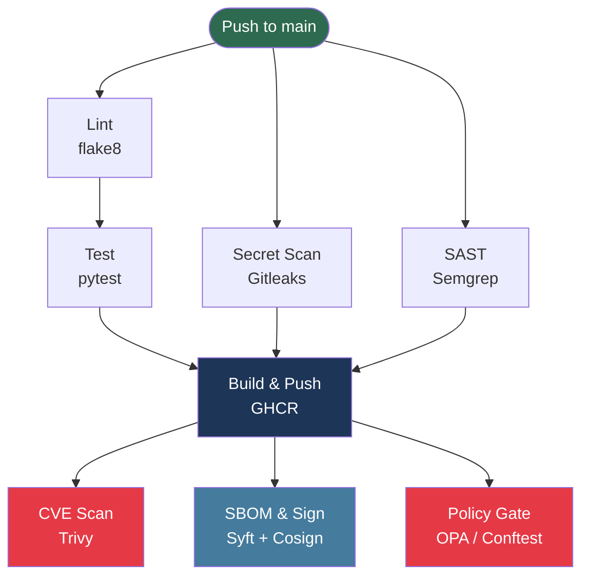

# DevSecOps Pipeline


A production-grade DevSecOps CI/CD pipeline built with GitHub Actions. Every commit is automatically linted, tested, scanned for secrets, analyzed for vulnerabilities, containerized, and cryptographically signed — before it can ever reach a deployment environment.

---

## Architecture



---

## Pipeline Stages

| Stage | Tool | What it does | Fails on |
|---|---|---|---|
| Lint | flake8 | Enforces code style | Style violations |
| Test | pytest | Runs unit tests | Any test failure |
| Secret Scan | Gitleaks | Scans full git history for leaked credentials | Detected secrets |
| SAST | Semgrep | Static analysis for OWASP Top 10 and Python security issues | Matched rules |
| Build & Push | Docker + GHCR | Multi-stage build, pushes to GitHub Container Registry | Build errors |
| CVE Scan | Trivy | Scans image for known CVEs in OS packages and Python deps | CRITICAL or HIGH with a fix |
| SBOM | Syft | Generates a Software Bill of Materials (SPDX-JSON) | — |
| Image Sign | Cosign | Keyless signing via GitHub OIDC + Sigstore | Signing failure |
| Policy Gate | OPA / Conftest | Evaluates Trivy JSON against Rego policies | Any CRITICAL CVE with a fix |

---

## Security Design

**Defense in depth** — security checks are layered across the entire pipeline, not bolted on at the end:

- **Shift left**: secrets and SAST run in parallel with tests, before a single Docker layer is built
- **Least privilege**: each job declares only the GitHub permissions it needs
- **Immutable artifacts**: every image is tagged with its git SHA and cryptographically signed
- **Policy as code**: deployment rules live in `policy/trivy.rego` — version-controlled, reviewable, auditable
- **Non-root container**: the app runs as `appuser` inside the container, not root

---

## Project Structure

```
devsecops-pipeline/
├── app/
│   └── main.py              # Flask app (/health, /hello)
├── tests/
│   └── test_app.py          # pytest tests
├── policy/
│   └── trivy.rego           # OPA policy: block on CRITICAL CVEs
├── .github/
│   └── workflows/
│       └── ci.yml           # Full CI/CD pipeline
├── Dockerfile               # Multi-stage, non-root
├── requirements.txt         # Runtime dependencies
├── requirements-dev.txt     # Dev/test dependencies
└── .gitleaks.toml           # Gitleaks configuration
```

---

## Local Development

**Prerequisites:** Python 3.12+, Docker

```bash
# Clone
git clone https://github.com/akshu0814/devsecops-pipeline.git
cd devsecops-pipeline

# Set up virtualenv
python3 -m venv .venv
source .venv/bin/activate
pip install -r requirements-dev.txt

# Run tests
pytest tests/ -v

# Run linter
flake8 app/ tests/

# Run the app locally
flask --app app.main run
# → http://localhost:5000/health
# → http://localhost:5000/hello
```

**Run with Docker:**

```bash
docker build -t devsecops-pipeline:local .
docker run -p 5000:5000 devsecops-pipeline:local
```

---

## Verify the Signed Image

Every image pushed to GHCR is signed with Cosign using keyless signing (no private key — identity is the GitHub Actions workflow itself via OIDC).

```bash
cosign verify ghcr.io/akshu0814/devsecops-pipeline:latest \
  --certificate-identity-regexp="https://github.com/akshu0814/devsecops-pipeline" \
  --certificate-oidc-issuer="https://token.actions.githubusercontent.com"
```

A successful verification confirms the image was built by this repository's CI workflow and has not been tampered with.

---

## Tech Stack

| Tool | Purpose |
|---|---|
| [Flask](https://flask.palletsprojects.com/) | Python web framework |
| [pytest](https://pytest.org/) | Testing framework |
| [flake8](https://flake8.pycqa.org/) | Python linter |
| [Docker](https://docker.com/) | Containerization |
| [GitHub Actions](https://github.com/features/actions) | CI/CD platform |
| [GHCR](https://ghcr.io/) | Container registry |
| [Gitleaks](https://github.com/gitleaks/gitleaks) | Secret scanning |
| [Semgrep](https://semgrep.dev/) | Static application security testing |
| [Trivy](https://github.com/aquasecurity/trivy) | Container vulnerability scanning |
| [Syft](https://github.com/anchore/syft) | SBOM generation |
| [Cosign](https://github.com/sigstore/cosign) | Container image signing |
| [OPA / Conftest](https://www.conftest.dev/) | Policy as code |

---

## License

MIT
